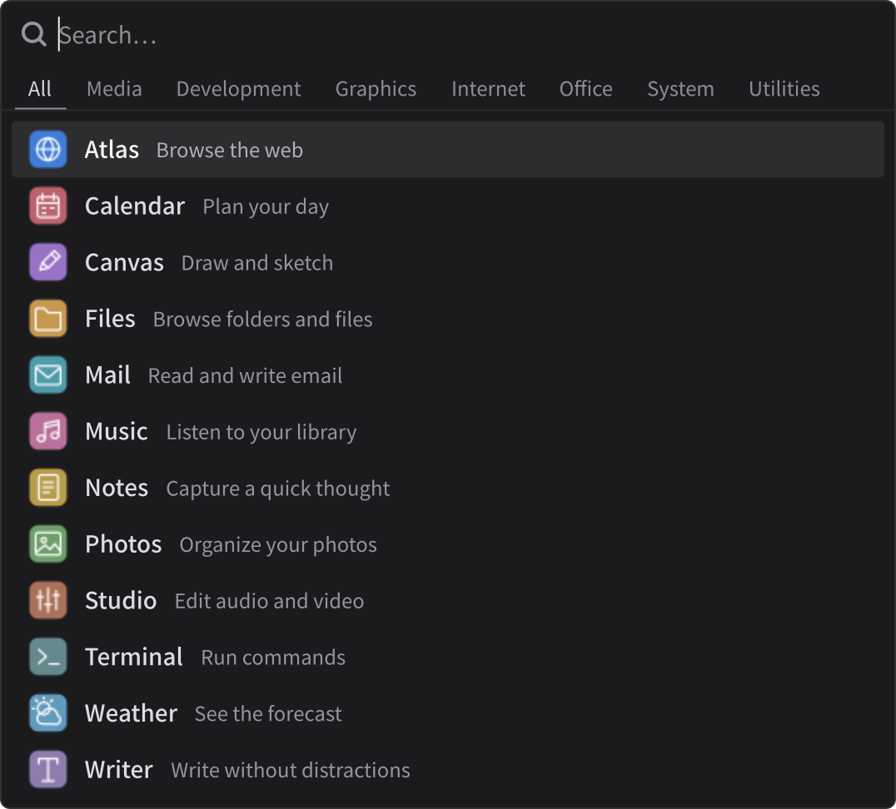
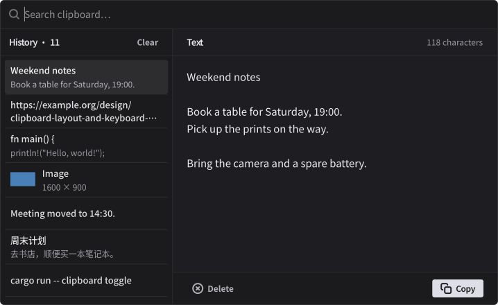
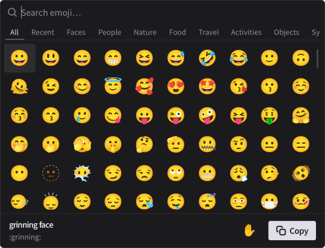

<p align="center">
  
</p>

<h1 align="center">Relvi</h1>
<h4 align="center">A focused launcher for Wayland</h4>

Relvi is a launcher for Wayland which focuses on finding apps and providing best fuzzy matching experience.

## Launcher

<p align="center">
  
</p>

### Search and history

Search app names, keywords, or executable names, including typos. Chinese names also match full Pinyin and initials. App names rank above descriptions; history helps order similar matches. With no query, frequent and recently used apps come first.

Category tabs filter the results. The catalog updates when apps are installed or removed.

Search uses [Polysearch](https://github.com/so1ve/polysearch). I tune its matching rules based on everyday use.

### Shortcuts

| Action | Shortcut |
| --- | --- |
| Open an app | <kbd>Enter</kbd> or a single click |
| Previous / next result | <kbd>↑</kbd> / <kbd>↓</kbd>, <kbd>Ctrl</kbd> + <kbd>K</kbd> / <kbd>Ctrl</kbd> + <kbd>J</kbd>, or <kbd>Ctrl</kbd> + <kbd>P</kbd> / <kbd>Ctrl</kbd> + <kbd>N</kbd> |
| Scroll half a page | <kbd>Ctrl</kbd> + <kbd>U</kbd> / <kbd>Ctrl</kbd> + <kbd>D</kbd> |
| Previous / next category | <kbd>Shift</kbd> + <kbd>Tab</kbd> / <kbd>Tab</kbd> or <kbd>Ctrl</kbd> + <kbd>H</kbd> / <kbd>Ctrl</kbd> + <kbd>L</kbd> |
| Close | <kbd>Esc</kbd> |

Show the launcher with `relvi`, or show/hide it with `relvi toggle`. Clear launch and query history with `relvi clear-history`.

## Clipboard

<p align="center">
  
</p>

Open this view with `relvi clipboard`, or show/hide it with `relvi clipboard toggle`. Toggling also switches from the launcher to clipboard history.

### Shortcuts

| Action | Shortcut |
| --- | --- |
| Previous / next entry | <kbd>↑</kbd> / <kbd>↓</kbd>, <kbd>Ctrl</kbd> + <kbd>K</kbd> / <kbd>Ctrl</kbd> + <kbd>J</kbd>, or <kbd>Ctrl</kbd> + <kbd>P</kbd> / <kbd>Ctrl</kbd> + <kbd>N</kbd> |
| Scroll half a page | <kbd>Ctrl</kbd> + <kbd>U</kbd> / <kbd>Ctrl</kbd> + <kbd>D</kbd> |
| Focus search | Start typing, or press <kbd>←</kbd> / <kbd>→</kbd> |
| Copy selected entry | <kbd>Ctrl</kbd> + <kbd>C</kbd>, <kbd>Enter</kbd>, or the Copy button |
| Delete selected entry | <kbd>Ctrl</kbd> + <kbd>Delete</kbd> |
| Clear history | <kbd>Ctrl</kbd> + <kbd>Shift</kbd> + <kbd>Delete</kbd> or the Clear button |
| Close | <kbd>Esc</kbd> |

Up/down navigation returns focus to the last selected entry.

### Storage

Relvi records text (up to 64 KiB) and PNG/JPEG images (up to 16 MiB and 64 megapixels). It keeps up to 100 entries within a 64 MiB memory budget, including image previews. Copying an image preserves its original data. Duplicates move to the front; entries marked by password managers are excluded.

History survives restarts in `$XDG_STATE_HOME/relvi/clipboard.json` (normally `~/.local/state/relvi/clipboard.json`). Images are stored separately in the adjacent `clipboard/` directory. Both are unencrypted, with access restricted to your user. Removing an image also removes its stored file. Run `relvi clipboard clear` to erase history without changing the current clipboard.

Clipboard monitoring requires `ext-data-control` or `wlr-data-control` support in the compositor.

## Emoji

<p align="center">
  
</p>

Open with `relvi emoji`, or show/hide with `relvi emoji toggle`.

Search English or Chinese names and keywords, Pinyin, or shortcodes such as `:rocket:`. Categories filter the grid. Recently copied emoji appear first, and the Recent tab keeps the exact variants you used.

### Shortcuts

| Action | Shortcut |
| --- | --- |
| Copy an emoji | <kbd>Enter</kbd>, <kbd>Ctrl</kbd> + <kbd>C</kbd>, or a single click |
| Move left / right | <kbd>←</kbd> / <kbd>→</kbd> or <kbd>Ctrl</kbd> + <kbd>H</kbd> / <kbd>Ctrl</kbd> + <kbd>L</kbd> |
| Move up / down | <kbd>↑</kbd> / <kbd>↓</kbd>, <kbd>Ctrl</kbd> + <kbd>K</kbd> / <kbd>Ctrl</kbd> + <kbd>J</kbd>, or <kbd>Ctrl</kbd> + <kbd>P</kbd> / <kbd>Ctrl</kbd> + <kbd>N</kbd> |
| Previous / next category | <kbd>Shift</kbd> + <kbd>Tab</kbd> / <kbd>Tab</kbd> |
| Focus search | Start typing, or <kbd>Ctrl</kbd> + <kbd>F</kbd> |
| Scroll half a page | <kbd>Ctrl</kbd> + <kbd>U</kbd> / <kbd>Ctrl</kbd> + <kbd>D</kbd> |
| Change skin tone | Hand button or <kbd>Ctrl</kbd> + <kbd>T</kbd>; add <kbd>Shift</kbd> to cycle backwards |
| Close | <kbd>Esc</kbd> |

Left/right arrows edit the query while search has focus. Copying closes the picker; paste into your app as usual. The last 48 copied emoji and your skin tone preference are saved in `$XDG_STATE_HOME/relvi/emoji.json`.

The catalog loads on first use and works offline. Search annotations come from [Unicode CLDR](https://cldr.unicode.org/) under the [Unicode License](resources/emoji/LICENSE). To update the bundled annotations, run `cargo xtask emoji`.

## Install

### Nix

Run directly:

```sh
nix run github:so1ve/relvi
```

Or add the flake to your configuration:

```nix
inputs.relvi.url = "github:so1ve/relvi";
```

Then install its package:

```nix
{ inputs, pkgs, ... }:

{
  environment.systemPackages = [
    inputs.relvi.packages.${pkgs.stdenv.hostPlatform.system}.default
  ];
}
```

### From source

Build with nightly Rust and the GTK 4, gtk4-layer-shell, libadwaita, and pkg-config development packages installed:

```sh
cargo build --locked --release
install -Dm755 target/release/relvi "$HOME/.local/bin/relvi"
install -Dm644 data/dev.so1ve.Relvi.desktop "$HOME/.local/share/applications/dev.so1ve.Relvi.desktop"
install -Dm644 data/dev.so1ve.Relvi.svg "$HOME/.local/share/icons/hicolor/scalable/apps/dev.so1ve.Relvi.svg"
```

Ensure `~/.local/bin` is on the graphical session's `PATH`. Released Linux binaries also need compatible GTK 4, gtk4-layer-shell, and libadwaita libraries at runtime.

## Session setup

### Startup and keybindings

Start `relvi daemon` with your Wayland session. This keeps the app catalog in memory and records clipboard history between uses. Bind `relvi toggle`, `relvi clipboard toggle` and `relvi emoji toggle` to separate shortcuts.

<details>
<summary>Niri</summary>

```kdl
spawn-at-startup "relvi" "daemon"

binds {
    Alt+Space { spawn "relvi" "toggle"; }
    Alt+V { spawn "relvi" "clipboard" "toggle"; }
    Alt+. { spawn "relvi" "emoji" "toggle"; }
}
```

</details>

<details>
<summary>Hyprland</summary>

```lua
hl.on("hyprland.start", function()
    hl.exec_cmd("relvi daemon")
end)

hl.bind("SUPER + SPACE", hl.dsp.exec_cmd("relvi toggle"))
hl.bind("SUPER + V", hl.dsp.exec_cmd("relvi clipboard toggle"))
hl.bind("SUPER + .", hl.dsp.exec_cmd("relvi emoji toggle"))
```

</details>

<details>
<summary>Sway</summary>

```text
exec relvi daemon
bindsym $mod+space exec relvi toggle
bindsym $mod+v exec relvi clipboard toggle
bindsym $mod+. exec relvi emoji toggle
```

</details>

Run `relvi quit` to stop the resident process.

### Shell completions

Generate completions for your shell, for example:

```sh
relvi completions --shell fish
```

Supported shells: Bash, Elvish, Fish, PowerShell, and Zsh.

## License

[MIT](LICENSE). Made with ❤️ by [Ray](https://github.com/so1ve)
